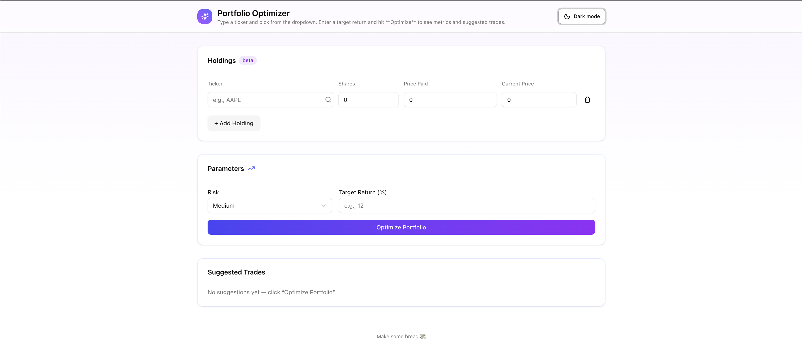

# Portfolio Optimization Dashboard — Project Write-Up

> A modern web app that helps an investor understand their portfolio, set a target return, and get **data-driven trade suggestions** that are tailored to the portfolio, not to tickers in isolation.

## TL;DR
- **Frontend:** A sleek Next.js dashboard where you enter holdings, a target return, and click **Optimize Portfolio**. You’ll see a clean summary plus suggested trades.
- **Backend:** A Node API route that computes portfolio statistics, builds portfolio-aware features, scores candidates with an ONNX-exported XGBoost model, and returns ranked suggestions.
- **Data:** Prices and fundamentals fetched from Alpha Vantage with aggressive local caching to stay under rate limits.

---

## Project Overview

**Goal.** Make sophisticated portfolio tools feel effortless. Instead of generic stock picks, we recommend tickers that are specifically likely to improve your portfolio’s Sharpe at your chosen target return.

**What the app does.**
1. You enter your holdings (ticker, shares, price paid).
2. You set a target return and click **Optimize Portfolio**.
3. The system computes a baseline optimal portfolio for your target and evaluates each not-held symbol’s marginal impact.
4. You get ranked suggestions with a short reason, indicative price, and (optionally) a share count if you pass a budget.

**Why it’s different.** The recommender is trained to predict whether a tiny addition of a ticker improves your current portfolio, not whether the ticker is “good” in a vacuum.

---

## Architecture at a Glance

- **Data layer & caching**
  - Prices and metadata come from Alpha Vantage.
  - Heavy use of a local cache (`/data-cache`) for weekly series, computed returns, covariance, and overview data to avoid hitting rate limits.

- **Model training (notebook)**
  - Build expected returns and a covariance matrix from weekly returns.
  - Construct portfolio-aware features and simulate tiny “adds” to label whether Sharpe improves.
  - Train a compact XGBoost classifier and evaluate on hold-out data.

- **Model export**
  - Convert the trained booster to ONNX with a matching columns JSON that freezes feature order.
  - Save both as `src/lib/recommend_model.onnx` and `src/lib/recommend_columns.json`.

- **API**
  - `/api/recommend-trades` rebuilds the baseline for the current user, engineers features for not-held tickers, validates the feature order, scores candidates with onnxruntime in Node, and returns the top suggestions.

- **Frontend UX**
  - Lightweight, keyboard-friendly holdings table.
  - Live price fetches with memoization and normalization.
  - A modern card layout, subtle gradients, and a working light/dark toggle.

---

## The Recommendation Feature (How It Works)

**1) A baseline for each user.**  
From cached market data we compute expected returns and a covariance matrix. With your target return, we solve a clean long-only mean–variance problem to get a baseline portfolio (weights *w\**). All comparisons are relative to this baseline.

**2) Portfolio-aware features.**  
For every candidate ticker not already held, we build a compact feature vector:

- **Delta signals**
  - `deltaSharpe`: estimated Sharpe change from a tiny add.
  - `deltaCvar`: estimated change in tail risk (95% CVaR proxy).
- **Series & fundamentals**
  - `mom6`, `mom12` (6/12-month momentum), `beta`, `divYield`, `logCap`.
- **Context**
  - `targetReturn` so the model adapts to the regime you asked for.

We freeze the column order to JSON and validate it on every API call so training/serving never drift.

**3) Labels by simulation.**  
Simulate very small adds of each candidate to many baseline portfolios and label the outcome:
- **1** if Sharpe improves, **0** otherwise.

This yields true “what-if” outcomes that reflect real portfolio interactions rather than factor lore.

**4) Train a compact gradient-boosted classifier.**  
Using XGBoost with modest depth and ~600 trees gave an excellent held-out performance (ROC-AUC ≈ 0.97, PR-AUC ≈ 0.99). We can run at a conservative threshold or simply rank by score and take top-K.

**5) Export to ONNX (and keep it compatible).**
- Remap feature names to `f0…fN` for converter compatibility.
- Disable ZipMap so the output is a raw ndarray in Node.
- Validate feature dimension at runtime to fail fast on mismatches.

**6) Scoring at runtime (Node).**  
On **Optimize**:
1. Rebuild the baseline with your holdings & target.
2. Engineer features for all not-held symbols.
3. Validate the feature order and shape.
4. Run the ONNX model in Node, grab scores, and rank candidates.
5. Optionally convert top scores to share counts using cached prices if you pass a budget.

**7) Why it works.**  
Instead of asking “is this ticker good?”, we ask **“is this addition good for your current portfolio?”** The model internalizes cross-effects via `delta*` features and the covariance structure, so the recommendations are portfolio-specific.

---

## Using the App

1. **Enter holdings.** Type a ticker and shares. Prices populate automatically; you can override them.
2. **Set a target return.** Leave blank until you know what you want; then type a number (e.g., 12) and click **Optimize Portfolio**.
3. **Review output.**
   - A compact metrics summary (placeholder metrics today; the back end computes the real math).
   - A ranked list of suggested trades with reasons, indicative prices, and optional share counts if you provided a budget.

---

## Data & Caching

- **Sources:** Alpha Vantage for weekly series, quote data, and overview fundamentals.
- **Caching:** We cache series (`weekly_XXX.json`) and computed artifacts (`stats_returns.json`, `stats_cov.json`, etc.) under `/data-cache`.
- **Why:** Prevent rate-limit lockouts and make local iteration fast and stable.
- **ETFs:** Metadata can be patchy; we rely more on computed series features (e.g., momentum) and keep conservative fallbacks for yield/size.

---

## Challenges

- **Rate limits.**  
  The free API tier throttles quickly. Mitigations:
  - Disk cache for expensive queries and precomputations.
  - Smaller universe during development in the notebook.
  - Normalized and memoized quote fetches in the UI to avoid thrash.

- **ETF data quality.**  
  Some ETF fields are missing or lagged. We:
  - Emphasized momentum & portfolio-aware features that don’t depend on spot fundamentals.
  - Added safe fallbacks (e.g., dividend yield → 0 if absent).

- **Price stability while typing.**  
  Normalize tickers (Aapl → AAPL), prefer `GLOBAL_QUOTE` with weekly fallback, and cache prices in memory to stop flicker.

- **Model export pitfalls.**  
  Classic ONNX converter issues (shape calculators, ZipMap, feature naming) were fixed by:
  - Exporting from the booster with `convert_xgboost`.
  - Remapping feature names to `f0…fN`.
  - Shipping a columns JSON and validating shape every run.

---

## What’s Next

- A richer universe with a higher-throughput price source.
- Proper position sizing that accounts for minimum lot sizes, risk parity, or turnover constraints.
- Per-user history for “why this was recommended” transparency over time.
- Deployment hardening (retry/backoff, circuit breakers, smarter caching windows).
